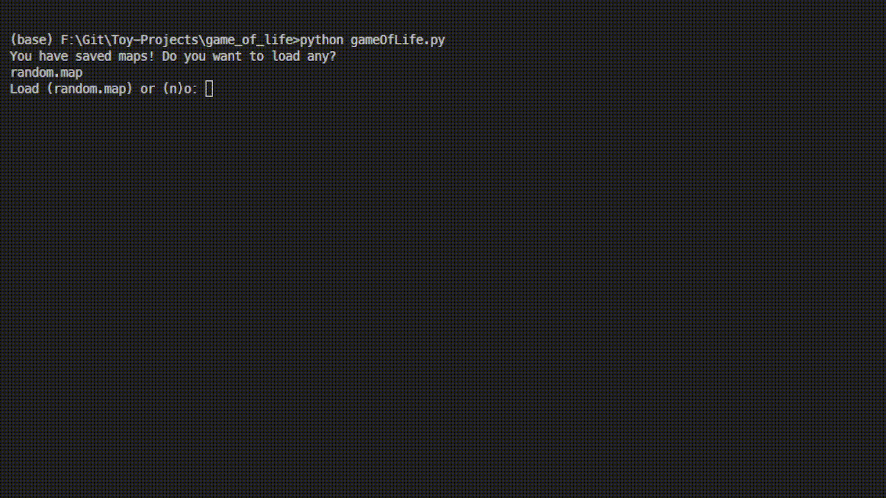
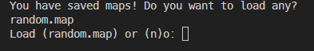

# ASCII Game of Life

I created a simple ASCII [Conway's Game of Life](https://en.wikipedia.org/wiki/Conway%27s_Game_of_Life) simulation in this python3 project.



It has a map loader, where you can load any map from the `maps` folder. 



# Running the Game
```bash
$ python3 gameOfLife.py
```
