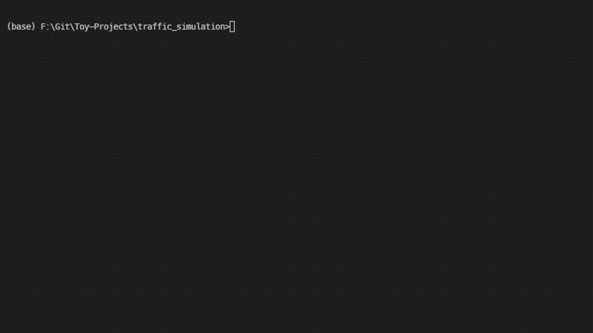

# ASCII Traffik Simulation

This is a basic traffic cellular automaton. 
It simulates traffic in a multilane road, by applying 
5 simple rules to each car on the road.

1. **(Accelerate)** in each step by 1 unit, until the maxspeed 5 is reached. The speed is the amount of tiles a car travels in a step
2. **(Break)** if a car is before you, to the velocity equal to the distance to the car. If no car is present, then continue to move at you old speed. 
3. **(Dawdle)** with a random chance (here 15%). This means, that you decelerate by 1 speed unit.
4. **(Move)** to the new location, which is old location + velocity.

# Extra feature ideas
- Moving cars to another lane, for example to overtake.
- Cars driving of the high way (disappearing from the map)